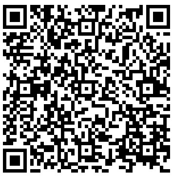

## [上課課程] : 星期一 早上 09:10  　　　　　　   [上課地點] : 和平樓，第二電腦教室
## [上課班級] : 電機三忠　　　　    　　　　　　     [授課老師] : 蔡正雄 龍華科技大學 電子工程系

| 上課班群(Line)  QRCode |----------|課程教材網址 QRCode |
|-----------------------|----------|---------------------|
| |----------| |
